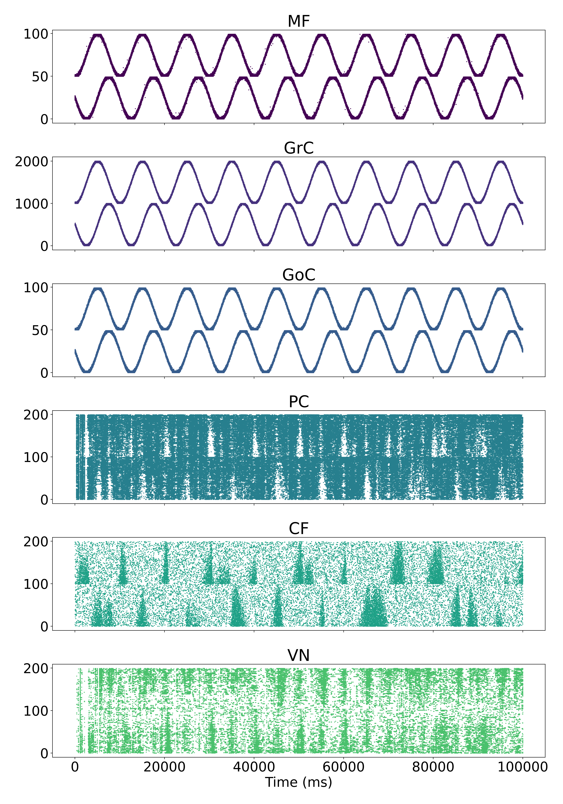

# Full-scale tests

These are the experiments we really want to run. A full cerebellar model is implemented. It interacts with the 
SpiNNGym environment to control eye movements. The goal of learning is for the cerebellum model to produce eye movements
that are in counter phase with the prescribed head movements of the simulated robot. Effectively, this would result in 
the eyes fixating a point in space in spite of the head movements. 

The main experiments here are:
  - [cerebellum_experiment](cerebellum_experiment.py) - main experiment using realistic head movements and velocities
  - [target_reaching_experiment](target_reaching_experiment.py) - experiment involving artificial movement targets to
  validate the behaviour of the cerebellum model on a relatively simpler task 
  - [cerebellum_from_file](cerebellum_from_file.py) - script that takes as input an archive containing a previously
  trained network, applies that connectivity to the cerebellum model without enabling learning and tests whether
  those weights can still appropriately solve the VOR.
  
 ## Cerebellum experiment
 
 Raster plot of activity in the network:

 Movement plot, showing VN, CF and PC activity with recordings from the SpiNNGym environment (R/L accumulator counts, 
 Error, Position and velocity):

The velocity should be matched as well here, but that's still a work in progress.

 ## Target reaching experiment
 4 experiments here: "zero", "constant", "bistate", "tristate".
 For use examples, see [basic_tests.sh](target_reaching_experiments/basic_tests.sh)
 
 ## Cerebellum from file
 
 Gain should be matched between pre-trained network and testing experiment. 