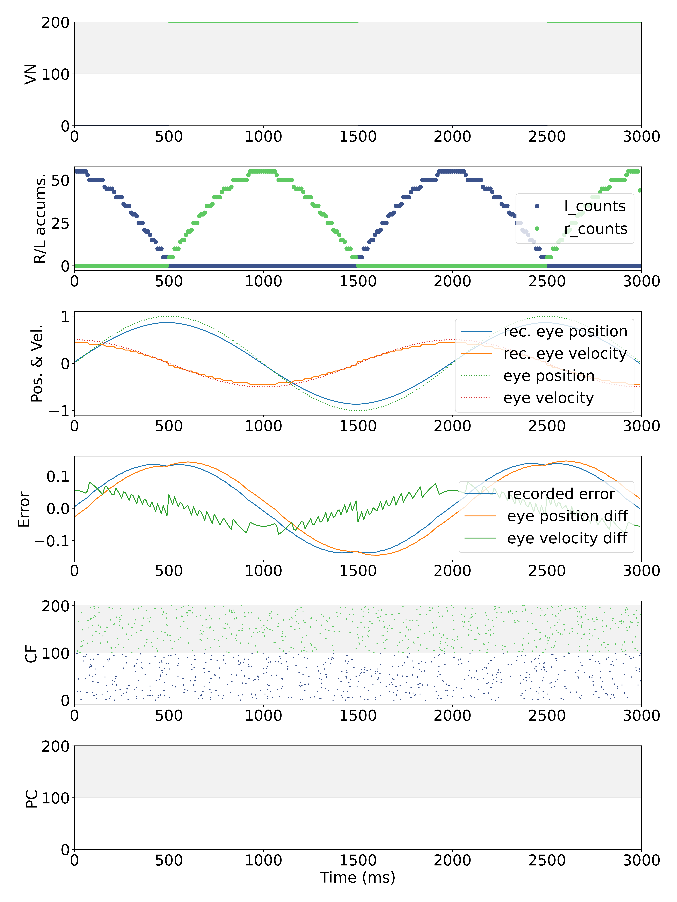

# SpiNNGym iCub environment tests

These scripts explore the behaviour of the SpiNNGym iCub environment driven by artificial stimulation.

These scripts test whether the error computation is performed correctly in the absence of movement, some movement 
and movement following the correct trajectory. Movement slowdown may be present. Different gains may be used.

